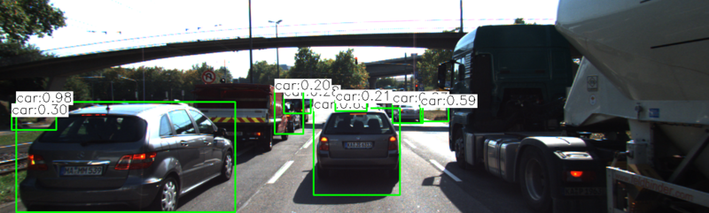
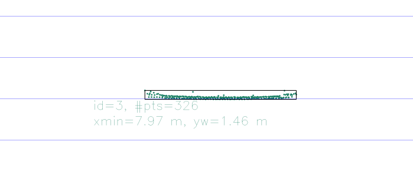
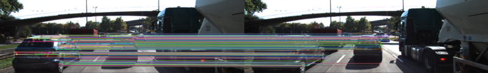
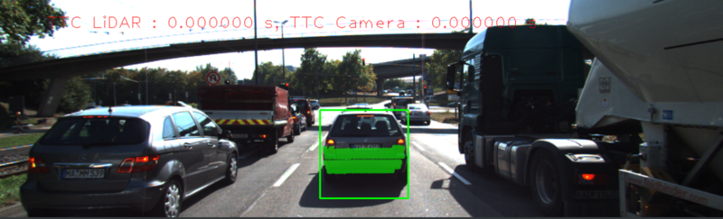
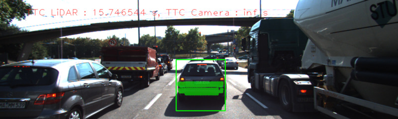
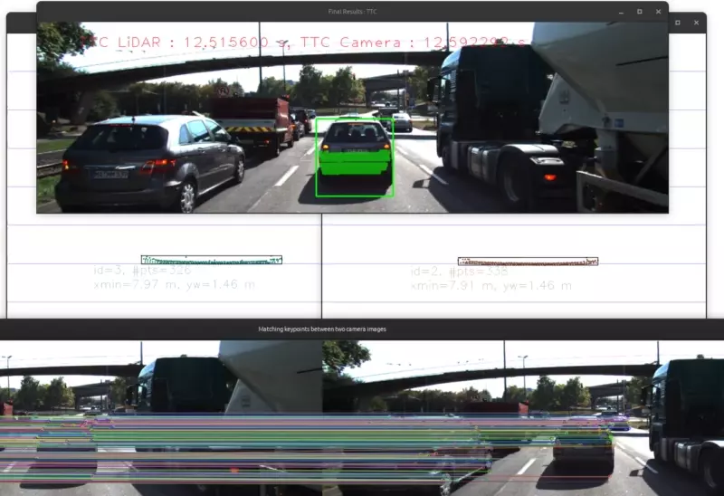
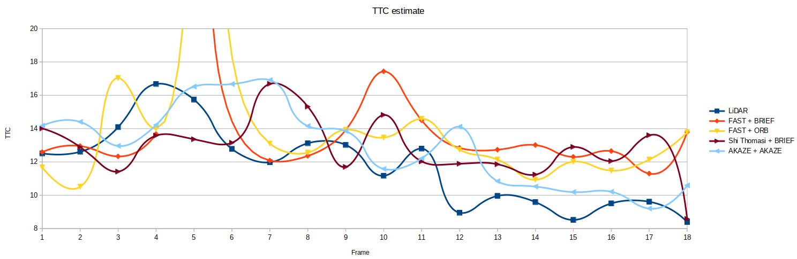

# 3D Object Tracking

This project is meant as an introduction to camera-based Sensor Fusion for Self-Driving Cars. The main points of it are:

- **Estimating Velocity from LiDAR points** and
- **Estimating Velocity from camera keypoints**.

This is achieved by

- Using Deep Neural Networks to **generate Regions of Interest**,
- **Combining LiDAR measurements with camera images** by projection between coordinate systems,
- **Clustering LiDAR points based on ROI** in image space,
- **Generating keypoint correspondences** between frames,
- **Tracking ROI over time** by matching keypoints,
- Determining **velocities by observing distance ratio changes** in image space.


In this final project, you will implement the missing parts in the schematic.
To do this, you will complete four major tasks: 

1. First, you will develop a way to match 3D objects over time by using keypoint correspondences. 
2. Second, you will compute the TTC based on LiDAR measurements. 
3. You will then proceed to do the same using the camera, which requires to first associate keypoint matches to regions of interest and then to compute the TTC based on those matches. 
4. And lastly, you will conduct various tests with the framework. Your goal is to identify the most suitable detector/descriptor combination for TTC estimation and also to search for problems that can lead to faulty measurements by the camera or LiDAR sensor. In the last course of this Nanodegree, you will learn about the Kalman filter, which is a great way to combine the two independent TTC measurements into an improved version which is much more reliable than a single sensor alone can be. But before we think about such things, let us focus on your final project in the camera course. 

## Basic Build Instructions

1. Clone this repo.
2. Make a build directory in the top level project directory: `mkdir build && cd build`
3. Compile: `cmake .. && make`
4. Run it: `./3D_object_tracking`.

### Dependencies for Running Locally

* cmake >= 2.8
  * All OSes: [click here for installation instructions](https://cmake.org/install/)
* make >= 4.1 (Linux, Mac), 3.81 (Windows)
  * Linux: make is installed by default on most Linux distros
  * Mac: [install Xcode command line tools to get make](https://developer.apple.com/xcode/features/)
  * Windows: [Click here for installation instructions](http://gnuwin32.sourceforge.net/packages/make.htm)
* Git LFS
  * Weight files are handled using [LFS](https://git-lfs.github.com/)
* OpenCV >= 4.1
  * This must be compiled from source using the `-D OPENCV_ENABLE_NONFREE=ON` cmake flag for testing the SIFT and SURF detectors.
  * The OpenCV 4.1.0 source code can be found [here](https://github.com/opencv/opencv/tree/4.1.0)
* gcc/g++ >= 5.4
  * Linux: gcc / g++ is installed by default on most Linux distros
  * Mac: same deal as make - [install Xcode command line tools](https://developer.apple.com/xcode/features/)
  * Windows: recommend using [MinGW](http://www.mingw.org/)

## Matching 3D Objects

First, regions of interests are obtained in `detectObjects()`
using a [YOLO](https://pjreddie.com/darknet/yolo/) v3
detector that was trained on the [COCO](http://cocodataset.org/) ("_Common Objects in Context_")
data set. The COCO dataset contains a couple of classes relevant to street scene
understanding, such as

- person, 
- bicycle, 
- car, motorbike, bus, truck,
- traffic light, stop sign

and more. Since a pre-trained network was used, detections were trimmed
after the fact to only provide `car` class instances, and all predictions
with a confidence lower than 0.2 were discarded. This yielded the following
result:



Next, a point cloud obtained in `loadLidarFromFile()`
from a [Velodyne HDL-64E](http://velodynelidar.com/lidar/hdlproducts/hdl64e.aspx) 
sensor (data was given as part of the [KITTI](http://www.cvlibs.net/datasets/kitti/) dataset)
was cropped in `cropLidarPoints()` to contain only points that lie

- within the ego lane,
- about 2 m behind up to 20 m ahead of the car, and
- roughly above road surface.

A planar road without lateral curvature was assumed for simplicity.
After this, all LiDAR not lying within one of the previously detected
rectangular regions of interest (ROI) were discarded in `clusterLidarWithROI()`.
To counter rough ROI shapes and oversized boxes (and artifact of the neural
network's output), each detected rectangle was reduced by approximately 20%
along width and height. The bounding boxes were then shrinked to exactly contain
all LiDAR points. Due to the previous cropping, only one box is obtained as a result:



During this process, each LiDAR point is also associated with the bounding box it is confined in.

In order to perform image feature detection, a mask was obtained in `createKeypointMask()`
from the ROIs to focus only on relevant areas of the image (the cars, as far as this
project is concerned):


Note that due to the limitation on the `car` class, the truck on the
right side of the image is effectively invisible after this procedure.
This is acceptable in the setup of this project.

A [FAST](https://en.wikipedia.org/wiki/Features_from_accelerated_segment_test)
feature detector using BRIEF keypoints was selected (note that this
combination almost resembles [ORB](https://en.wikipedia.org/wiki/Oriented_FAST_and_rotated_BRIEF),
which was however discarded as part of the conclusions of the [2D Feature Tracking](https://github.com/sunsided/SFND_2D_Feature_Tracking)
project) and used to obtain keypoints in `detectKeypointsModern()`
and provide descriptors in `describeKeypoints()`.

Keypoints were then matched with the previous frame in `matchDescriptors()` ...



... in order to determine ROI / bounding box correspondences across frames in `matchBoundingBoxes()`.
By this, tracking of a 2D object through time is implemented.

Since LiDAR points were already associated with bounding boxes as
part of the initial steps, correspondence between 3D measurements from
the LiDAR point cloud and linked 2D information obtained from the YOLO
detector can be obtained, which effectively allows tracking 3D objects
(the LiDAR points) over time:



Note that at this point of the project, a Time-to-Collision estimate
was not yet generated, resulting in a reported `0.000000 s` value in the
referenced picture.

## Computing LiDAR-based Time-to-Collision

Due to the availability of LiDAR-based measurements of physical distance
of the car in front of the ego car we can now utilize changes in distance
to approximate relative velocity and, by extension, time-to-collision.  

Under the assumption of a constant velocity model as an approximation 
of the velocity during small time steps ΔT, and by making use of
the clustered LiDAR points of the car in front of the ego car,
we can utilize the change of the median X ("front") distances between
frames to provide a TTC estimate in `computeTTCLidar()`:

```cpp
const auto dT = 1 / frameRate;
const auto TTC = dT * currX / (prevX - currX);
```

Note that the constant-velocity model should be avoided in real scenarios
in favor of (at least) a constant-acceleration model. By using a ROI
generator that is capable of recognizing license plates, we might also
provide a more stable focus area for our computation that has 

- a lower chance of providing stray LiDAR points (due to reduced region size),
- a higher signal strength due to high reflectivity of license plates in general,
- less variance in the X coordinates. 

As mentioned above, in order to determine the the previous and current X
coordinates, the median X coordinate is selected for this calculation
via `getMedianPointByXCoordinate()`:

```cpp
const auto medianPre = getMedianPointByXCoordinate(lidarPointsPrev);
const auto prevX = medianPre.x;

const auto medianCurr = getMedianPointByXCoordinate(lidarPointsCurr);
const auto currX = medianCurr.x;
```

This should be a reasonable estimate of the real distances, as it is
robust against outliers (unlike e.g. the mean).

In practice, LiDAR points that lie within the same ROI may still
belong to different physical objects, e.g. when the LiDAR "overshoots"
the object in front of the ego car and measures a target further way.
Using the median point may not be helpful in this situation and e.g.
a quantile based approach could work better.

## Computing Camera-based Time-to-Collision

In addition to the LiDAR-based time TTC estimation, a purely camera-based
estimation was added as well. In here, the relative change in distances
between (matched, meaningful) keypoints across frames is observed in order
to determine an approximate change in scale in the image plane.

For this, we're clustering all keypoint matches that belong to the
ROI of choice in `clusterKptMatchesWithROI()` and ensure that we only
consider keypoints that did not jump more than a defined threshold,
e.g. 25% of the average distance of keypoints. This ensures that
no wildly mismatched keypoint will throw off the calculation:

```cpp
const auto averageDistance = containedPointMeanDistance(
    boundingBox, kptMatches, kptsPrev, kptsCurr);
const auto tolerance = averageDistance * 1.25;

for (const auto &match : kptMatches) {
    // ...
    if (!boundingBox.roi.contains(currPt.pt)) continue;
    const auto d = cv::norm(currPt.pt - prevPt.pt);
    if (d >= tolerance) continue;
    //...
    bounding_box.kptMatches.push_back(match);
}
```

We can now relate changes in the projected image with distances in the real
world by utilizing the fact that focal length and physical distance
cancel out.

Care needs to be taken, however, not to try to relate
keypoints that are too close together (as this may result in a division
by a very small number when trying to determine the distance ratio)
and that the scales actually change. 

```cpp
const auto minDistPx = 100.0; // minimum required distance in pixels
const auto epsilon = 1e-4;    // smallest allowed divisor

for (auto it1 = kptMatches.begin(); it1 != kptMatches.end() - 1; ++it1) {
    const auto currKpToken, prevKpToken = // ...
    
    for (auto it2 = kptMatches.begin() + 1; it2 != kptMatches.end(); ++it2) {
        const auto currKp, prevKp = // ...

        const auto distCurr = cv::norm(currKpToken.pt - currKp.pt);
        const auto distPrev = cv::norm(prevKpToken.pt - prevKp.pt);

        // avoid division by zero
        if (distPrev <= epsilon || distCurr < minDistPx) continue;

        const auto distRatio = distCurr / distPrev;
        distanceRatios.push_back(distRatio);
    }
}
```

This - in combination with the constant velocity equation - 
leaves us with the following rather cute approximation in `computeTTCCamera()`:

```cpp
const auto dT = 1 / frameRate;
TTC = -dT / (1 - distanceRatio);
```

Again, the median measured distance ratio is used to obtain a stable
estimate:

```cpp
std::sort(distanceRatios.begin(), distanceRatios.end());
const auto medianIndex = distanceRatios.size() / 2;
const auto distanceRatio = (distanceRatios.size() & 1U) == 1U
                           ? distanceRatios[medianIndex]
                           : (distanceRatios[medianIndex - 1] + distanceRatios[medianIndex]) / 2.0;
```
 


If no scale change occurs, the
distance ratio will be one and yield a division by zero.
Treating these situations as an "infinite" TTC is reasonable, as it
does take an infinite amount of time for two equally fast moving
objects to collide.



## Performance Evaluation

When inspecting the LiDAR point cloud over time we can verify
that the ego car is constantly approaching the car in front of it,
thereby reducing distance. TTC estimates appear to be reasonably sane
(supported by the median filtering),
although in several frames the LiDAR TTC estimate jumps up a couple
of seconds, then down again, spanning a range of about four seconds. 



In a first occurrence, the TTC estimate jumps to 16.69 s, then
drops back to 12.78s despite no drastic change in distance can be observed:

TTC = 16.69 s


TTC = 12.78 seconds


Note that the above frames do not follow each other immediately,
but in close vicinity.

In another instance, the TTC estimate jumps up to 12.81 s, then
drops down to 8.86 s in the next frame:

TTC = 12.81 seconds


TTC = 8.95 seconds


Specifically the last example shows an interesting effect: Even though
the car is closer to the ego car in the first frame (7.20 m) than it is
in the second one (7.27 m), the estimate goes down - indicating closer
proximity. While the TTC value for the second frame might be correct,
it isn't entirely consistent with the value before.

There, we measured a (closest) distance
of 7.39 m from the ego car, indicating that either party moved by 0.19 m
between two video frames. We can see that in one of the frames (top right),
a stray LiDAR point throws off the minimum distance estimate (even though
this should not affect the velocity calculation due to the use of the
median distance).

I am concluding that using a single model alone in combination with
a constant velocity calculation just isn't good enough.

## Keypoint vs. LiDAR Performance Evaluation

In [2D Feature Tracking](https://github.com/sunsided/SFND_2D_Feature_Tracking),
the following detector / descriptor combinations were suggested:

- FAST with BRIEF descriptors,
- FAST with ORB descriptors (or both), as well as
- ORB with BRIEF descriptors

In addition, the Shi Thomasi + BRIEF option, as well as AKAZE/AKAZE were tested as well.

| Frame | LiDAR | FAST + BRIEF | FAST + ORB | ORB + BRIEF | Shi Thomasi + BRIEF | AKAZE + AKAZE |
|-------|-------|--------------|------------|-------------|---------------------|---------------|
| 1     | 12.51 | 12.59        | 11.67      | 49.50       | 14.01               | 14.17         |
| 2     | 12.61 | 12.95        | 10.51      | -           | 12.89               | 14.40         |
| 3     | 14.09 | 12.33        | 17.04      | -6725.56    | 11.42               | 12.96         |
| 4     | 16.68 | 13.67        | 13.99      | 15.65       | 13.58               | 14.22         |
| 5     | 15.74 | -            | 100.98     | 163.77      | 13.36               | 16.52         |
| 6     | 12.78 | 41.78        | 55.97      | -           | 13.15               | 16.67         |
| 7     | 11.98 | 12.08        | 13.10      | 14.84       | 16.69               | 16.91         |
| 8     | 13.12 | 12.36        | 12.56      | -           | 15.32               | 14.15         |
| 9     | 13.02 | 13.92        | 13.93      | -           | 11.70               | 13.85         |
| 10    | 11.17 | 17.43        | 13.46      | -           | 14.82               | 11.58         |
| 11    | 12.80 | 14.50        | 14.59      | 116.07      | 12.03               | 12.21         |
| 12    | 8.95  | 12.84        | 12.73      | 17.19       | 11.89               | 14.11         |
| 13    | 9.96  | 12.73        | 12.14      | 29.16       | 11.86               | 10.84         |
| 14    | 9.59  | 13.01        | 10.93      | 28.82       | 11.24               | 10.52         |
| 15    | 8.52  | 12.30        | 12.01      | 19.39       | 12.90               | 10.19         |
| 16    | 9.51  | 12.65        | 11.48      | 22.70       | 12.05               | 10.21         |
| 17    | 9.61  | 11.30        | 12.14      | 12.50       | 13.60               | 9.20          |
| 18    | 8.39  | 13.79        | 13.78      | 100.02      | 8.58                | 10.59         |

It as immediately obvious that an ORB detector (as was implied
in the [2D Feature Tracking](https://github.com/sunsided/SFND_2D_Feature_Tracking) repo)
is just not able to generate key points suited for the task at hand,
at least given the default detector configuration.

Ruling out ORB as a detector (and using 2nd-order B-splines for plotting
the values - I'm aware I shouldn't) here's how it unfolds.
When squinting real hard we can observe a collective upwards trend at
around t=4 to t=8, followed by a downward trend afterwards.
Apart from AKAZE, which generally tends to follow the LiDAR estimates
more closely than the other combinations, all the image-based
estimates appear to be off by about two seconds. 



Indeed, when observing the MSE in relation to the LiDAR estimates,
the AKAZE detector/descriptor combination performs best, with the 
Shi Thomasi + BRIEF combinations following up:

| Frame   | FAST + BRIEF | FAST + ORB | Shi Thomasi + BRIEF | AKAZE + AKAZE |
|---------|--------------|------------|---------------------|---------------|
| 1       | 0.08         | 0.84       | 1.5                 | 1.66          |
| 2       | 0.34         | 2.1        | 0.28                | 1.79          |
| 3       | 1.76         | 2.95       | 2.67                | 1.13          |
| 4       | 3.01         | 2.69       | 3.1                 | 2.46          |
| 5       |              | 85.24      | 2.38                | 0.77          |
| 6       | 29           | 43.19      | 0.37                | 3.89          |
| 7       | 0.1          | 1.12       | 4.71                | 4.93          |
| 8       | 0.76         | 0.55       | 2.2                 | 1.03          |
| 9       | 0.9          | 0.91       | 1.32                | 0.83          |
| 10      | 6.26         | 2.29       | 3.65                | 0.41          |
| 11      | 1.7          | 1.79       | 0.77                | 0.59          |
| 12      | 3.89         | 3.78       | 2.94                | 5.16          |
| 13      | 2.77         | 2.18       | 1.9                 | 0.87          |
| 14      | 3.42         | 1.34       | 1.65                | 0.93          |
| 15      | 3.78         | 3.49       | 4.38                | 1.67          |
| 16      | 3.14         | 1.97       | 2.54                | 0.70          |
| 17      | 1.69         | 2.53       | 3.99                | 0.41          |
| 18      | 5.4          | 5.39       | 0.19                | 2.2           |
|         |              |            |                     |               |
| **MSE** | **4**        | **9.13**   | **2.25**            | **1.74**      |
